# 2024-XDU-SCE-Fundamentals-of-Cyberspace-Security-Mathematics

2024年网络安全数学基础

这门课属于是上课教了一粒沙，作业要写撒哈拉。

而且前半部分的内容没有任何PPT、教材、资料。作业难度极大

需者自取

## 勘误及说明

你来我往之LFSR破译，反馈多项式并不是乱生成的，是有群论说法的。应该选择本原多项式作为反馈多项式。

然鹅作者水瓶有限，用的是随机生成法，这导致了有的反馈多项式做出来效果很差，会产生不唯一等现象。

实际上，就算我们知道反馈多项式不是乱选的，我们也很难选取本原多项式作为反馈多项式。这是因为本原多项式是很难求得的，常用的方法就是随机生成一个，然后再判断它是不是。

作业中是256bit的，作者这里给出一个GF（2^256）上的本原多项式，读者可以用它完成作业试试

\\[ x^{256}+x^{10}+x^{5}+x^{2}+1 \\]

HMM，依然存疑

svd水印、本人作业与老师课上给出的、以及考试中出现的均不甚相同，谨慎借鉴

svd扩展，作业过难，而且要求是隐写方面的。作者没有想到这方面的idea

数论中的prime.py就是一个质数列表。test.py仅仅是用计算机求解的程序，并不是作业

作者水平极其有限、必然有大量未发现的错误。读者请自己注意

## 作者声明

- 作者水平很低，是个菜鸡，作业中必然有错误内容

- 编程功力非常有限，代码中可能会产生迷惑行为，不许笑

- 目录结构很乱，主要原因是写作业的时候没考虑到开源

- 如果读者直接copy，作者个人没有任何意见，但是考试啥也不会是你自己的事。考试就考作业，甚至是作业原题，自重

- svd扩展我不会，因此本项目中没有，svd水印也存疑（虽然作业老师批了，还有评语，并且全部给出100分）

- 部分作业需要手写，主要是后面的群论内容。手写的作业由于作者字太丑（QAQ），不开源，具体而言，包括：**数论基础、代数基础、有限域、椭圆曲线**。项目中可能仍有这些目录，但目录中是资料、非手写内容、用于验证的代码等。并不是最终作业。

  

- 使用的编程语言几乎全部为Python。少量为MATLAB。本门课程几乎不涉及C/C++、JAVA。不选修python的同学可能会红温

- 代码、作业中如果出现了奇奇怪怪的东西，那是我忘了删，呜呜呜

- 欢迎联系作者讨论问题、批评指正。QQ 1049922754

## 每次作业题目

#### 第一次--你来我往之LFSR破译

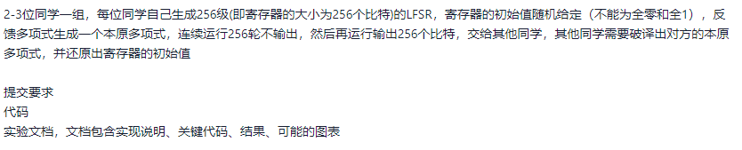

#### 第二次--SVD之去噪、水印、svd拓展

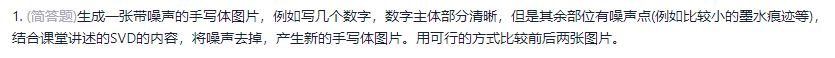

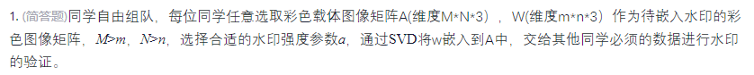

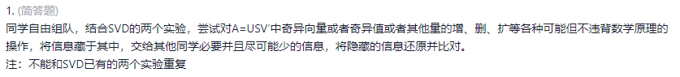

#### 第三次--离散马尔科夫链

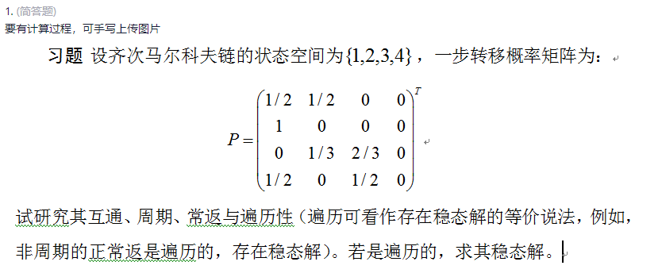

#### 第四次--HMM（隐马尔科夫链）

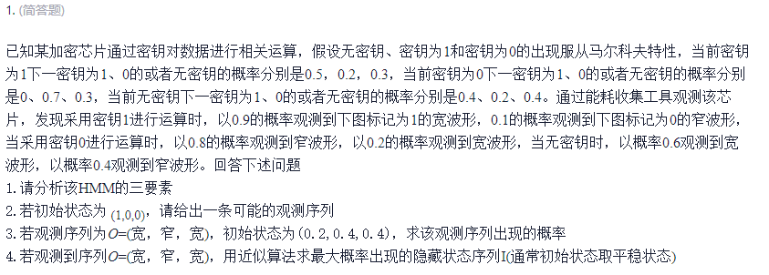

#### 第五次--Bloom过滤器设计

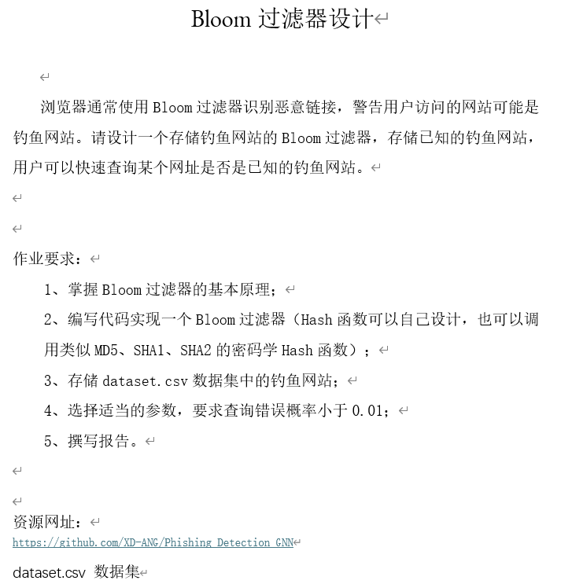

#### 第六次--数论基础

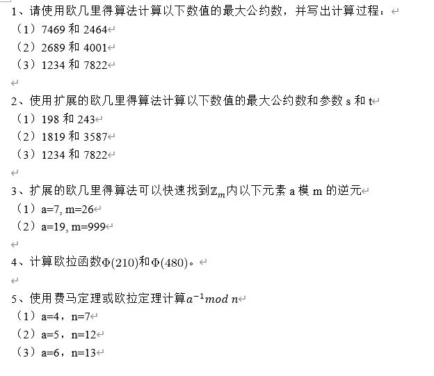

#### 第七次--代数基础、利用生日悖论求解离散对数

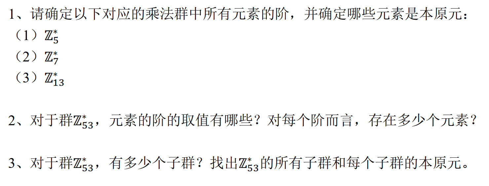

____

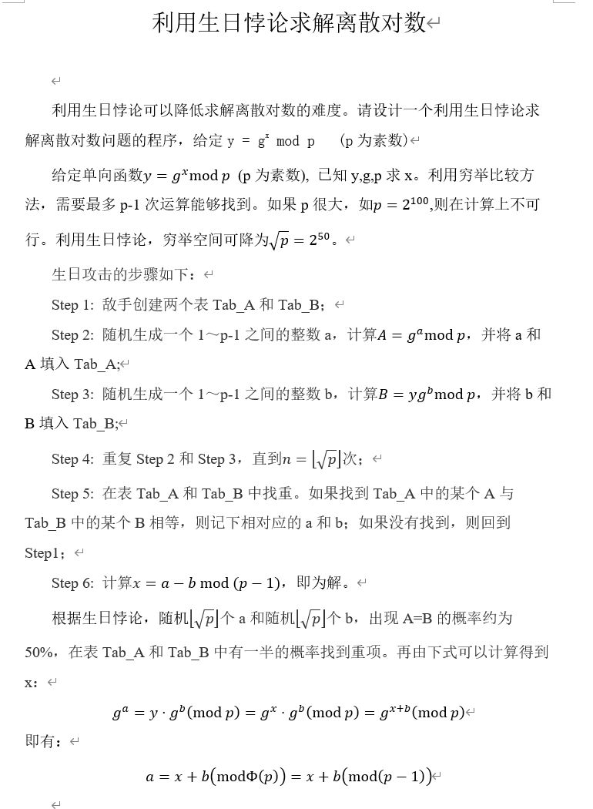

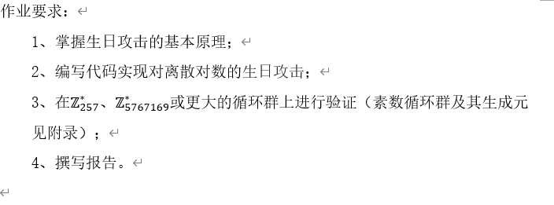

#### 第八次--概率论

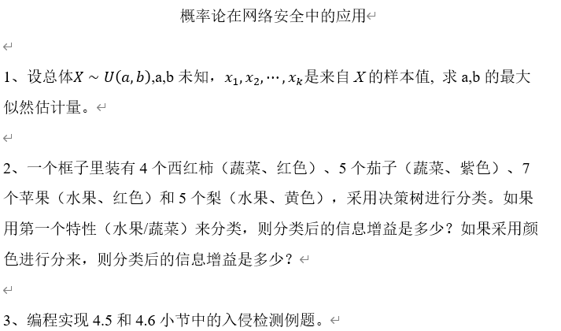

#### 第九次--有限域

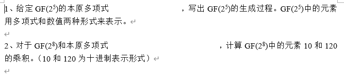

#### 第十次--椭圆曲线

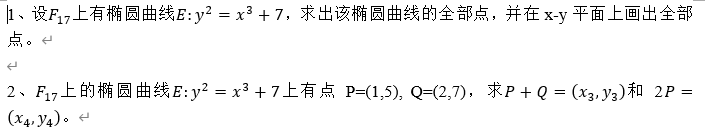

#### 第十一次--随机几何

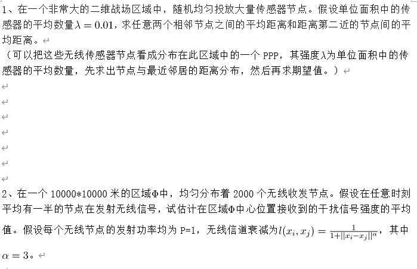
